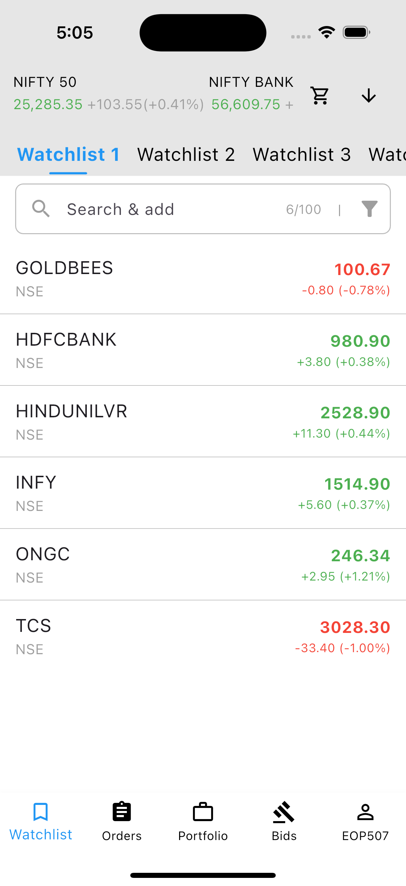
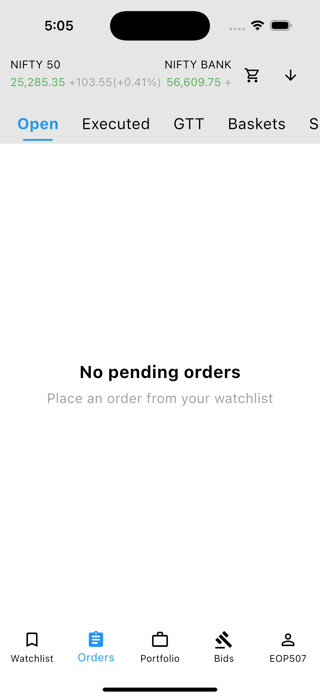
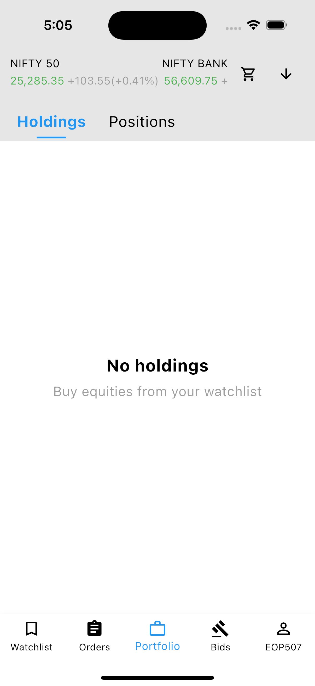
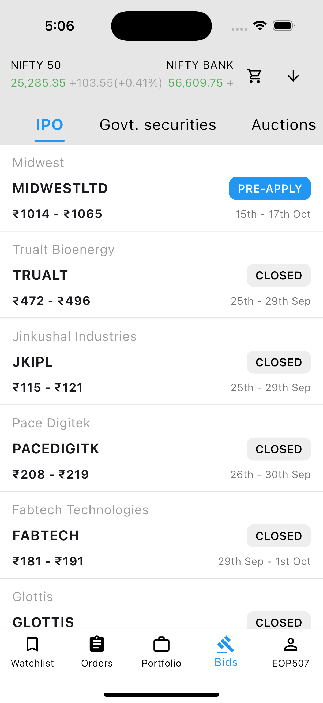
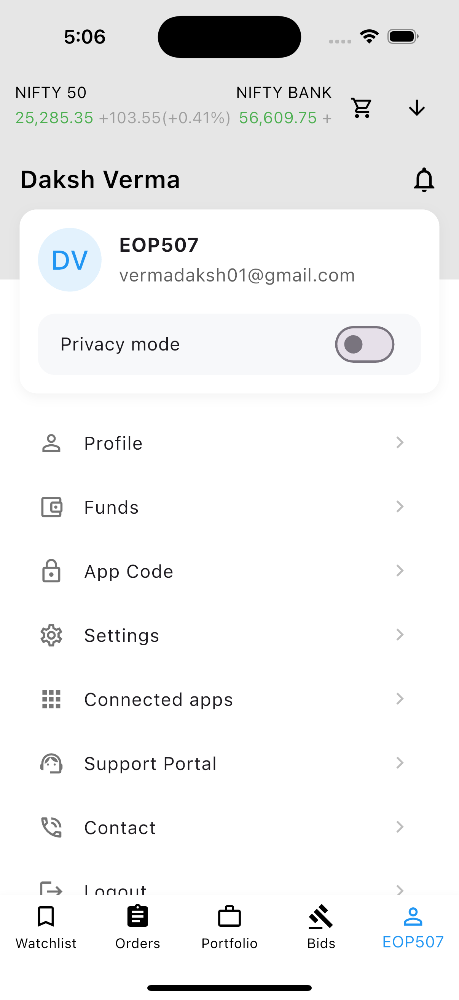
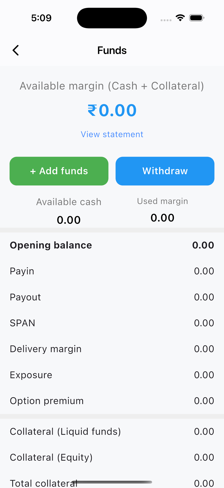
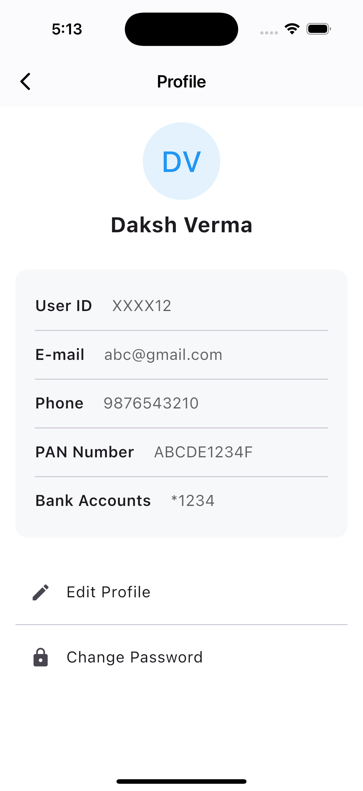
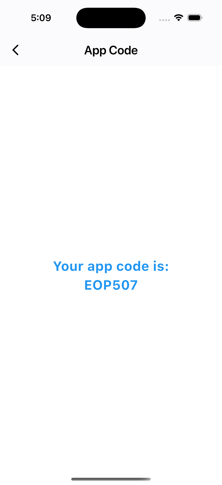
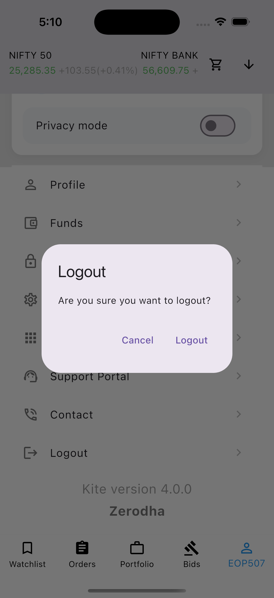

# Responsive Dashboard Flutter App 🚀

[](https://flutter.dev)
[](https://dart.dev)
[](LICENSE)

A **responsive Flutter dashboard application** built for multiple devices, showcasing trading, portfolio, and account management features. Created as part of the **Bandit Internship task**.

---

## 🌟 Features

- **Dashboard**: Live stock data visualization with clean UI.
- **Orders**: Track Open, Executed, GTT, SIPs, and Alerts.
- **Portfolio**: Holdings and positions.
- **Bids**: IPOs, Government Securities, and Auctions.
- **Profile**: User details with edit option.
- **Funds**: View margin, add funds, and withdraw.
- **Settings**: Toggle Dark Mode, Notifications, Location Access, etc.
- **App Code & Logout**: Securely view your app code and logout.

---

## 📸 Screenshots

| Dashboard | Orders | Portfolio |
|-----------|--------|----------|
|  |  |  |

| Bids | My Account | Funds |
|------|------------|-------|
|  |  |  |

| Settings | Profile | App Code | Logout |
|----------|--------|----------|--------|
|  |  |  |  |

---

## 🚀 Getting Started

### Prerequisites

- Flutter SDK >= 2.18.0
- Dart SDK >= 2.18.0
- Compatible IDE (VS Code / Android Studio)

### Installation

```bash
# Clone the repository
git clone <your-github-repo-link>
cd responsive_dashboard

# Install dependencies
flutter pub get

# Run the app
flutter run
